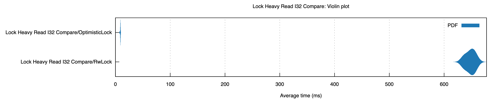
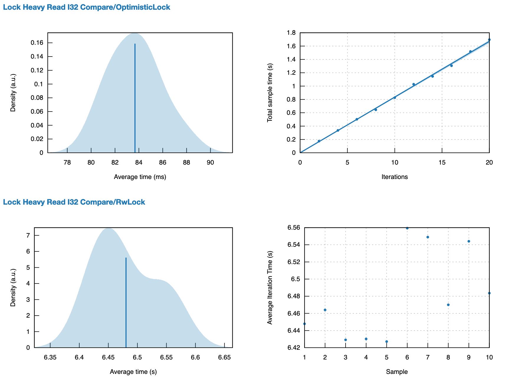
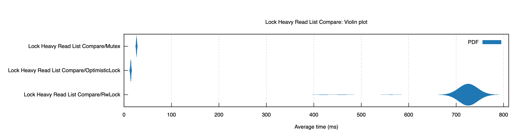
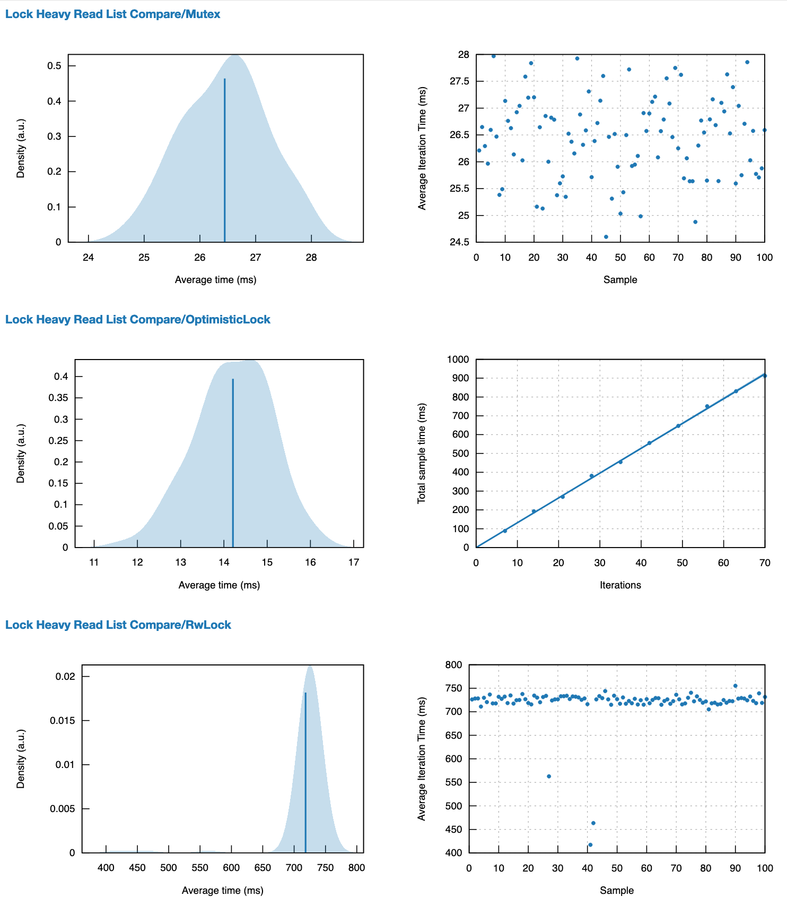

# Optimistic Lock Coupling

> from paper "Optimistic Lock Coupling: A Scalable and Efficient General-Purpose Synchronization Method"

In actual projects, there are some lock-free data structures, especially database-related ones such as `BwTree`, `Split-Ordered List` (also known as Lock Free HashTable) when there are many write conflicts.
The performance loss is very serious, and sometimes it is not as good as the brainless Mutex. However, the performance of the brainless Mutex is often very bad under normal circumstances, so is there an intermediate form that can solve this problem?

This is the intermediate form. So this can be used everywhere as a general lock, and the performance is satisfactory.

## But I have a lock-free data structure that is well designed and optimized for usage scenarios. Can’t it be your implementation?

Of course, this is better, but when you don't have 114514 PHD students to optimize your data structure, and you don't have 1919810 powerful debugging masters to deal with problems such as Memory Order, it will be tricky. 

<del>At this time, my project is already online, the investor has given me money. </del>

## So what are the disadvantages of such a data structure?

Of course there is~

The disadvantage of this data structure is mainly because of the use of a 61bit version, when this version is full, we can lie flat.
Of course, your data structure is crazy to change to this binary, it should be a problem for you to write the code. 
## Bench Mark Result
source code is under `\benches` dir.

### I32
- violin graph

- time graph

### Single Linked List
- violin graph

- time graph

## Lock Usage
when 3 reader core and 2 writer core

removed intermediate part of blocking log

|Operation|Delta Time|ThreadID|Status|
|-|-|-|-|
|Read|142869|ThreadId(6)|OptimisticLockCouplingReadGuard { version: 0, data: 1 }|
|ErrRead|216320|ThreadId(6)|failed to sync|
|ErrRead|222578|ThreadId(6)|Blocked|
|ErrRead|241218|ThreadId(6)|Blocked|
|Write|145456|ThreadId(2)|OptimisticLockCouplingWriteGuard { version: 0, data: 1 }|
|Write|291942|ThreadId(2)|OptimisticLockCouplingWriteGuard { version: 1, data: 2 }|
|Write|312349|ThreadId(2)|OptimisticLockCouplingWriteGuard { version: 2, data: 3 }|
|ErrWrite|147945|ThreadId(3)|Blocked|
|ErrWrite|530522|ThreadId(3)|Blocked|
|Write|319592|ThreadId(2)|OptimisticLockCouplingWriteGuard { version: 3, data: 4 }|
|Write|548172|ThreadId(2)|OptimisticLockCouplingWriteGuard { version: 4, data: 5 }|
|Write|605291|ThreadId(2)|OptimisticLockCouplingWriteGuard { version: 5, data: 6 }|
|Write|613679|ThreadId(2)|OptimisticLockCouplingWriteGuard { version: 6, data: 7 }|
|Write|618416|ThreadId(2)|OptimisticLockCouplingWriteGuard { version: 7, data: 8 }|
|Write|623453|ThreadId(2)|OptimisticLockCouplingWriteGuard { version: 8, data: 9 }|
|Write|627723|ThreadId(2)|OptimisticLockCouplingWriteGuard { version: 9, data: 10 }|
|ErrWrite|536923|ThreadId(3)|Blocked|
|Write|696435|ThreadId(3)|OptimisticLockCouplingWriteGuard { version: 10, data: 11 }|
|Write|704458|ThreadId(3)|OptimisticLockCouplingWriteGuard { version: 11, data: 12 }|
|Write|712664|ThreadId(3)|OptimisticLockCouplingWriteGuard { version: 12, data: 13 }|
|Write|718093|ThreadId(3)|OptimisticLockCouplingWriteGuard { version: 13, data: 14 }|
|Write|749839|ThreadId(3)|OptimisticLockCouplingWriteGuard { version: 14, data: 15 }|
|Write|755558|ThreadId(3)|OptimisticLockCouplingWriteGuard { version: 15, data: 16 }|
|ErrRead|149826|ThreadId(5)|Blocked|
|ErrRead|805119|ThreadId(5)|Blocked|
|ErrRead|810206|ThreadId(5)|Blocked|
|Write|775039|ThreadId(3)|OptimisticLockCouplingWriteGuard { version: 16, data: 17 }|
|Write|871475|ThreadId(3)|OptimisticLockCouplingWriteGuard { version: 17, data: 18 }|
|Write|891289|ThreadId(3)|OptimisticLockCouplingWriteGuard { version: 18, data: 19 }|
|Write|896488|ThreadId(3)|OptimisticLockCouplingWriteGuard { version: 19, data: 20 }|
|ErrRead|273387|ThreadId(6)|Blocked|
|Read|925559|ThreadId(6)|OptimisticLockCouplingReadGuard { version: 20, data: 20 }|
|Read|971184|ThreadId(6)|OptimisticLockCouplingReadGuard { version: 20, data: 20 }|
|Read|994963|ThreadId(6)|OptimisticLockCouplingReadGuard { version: 20, data: 20 }|
|Read|998833|ThreadId(6)|OptimisticLockCouplingReadGuard { version: 20, data: 20 }|
|Read|1002179|ThreadId(6)|OptimisticLockCouplingReadGuard { version: 20, data: 20 }|
|Read|1005515|ThreadId(6)|OptimisticLockCouplingReadGuard { version: 20, data: 20 }|
|Read|1008870|ThreadId(6)|OptimisticLockCouplingReadGuard { version: 20, data: 20 }|
|ErrRead|831229|ThreadId(5)|Blocked|
|Read|1055143|ThreadId(5)|OptimisticLockCouplingReadGuard { version: 20, data: 20 }|
|Read|1076076|ThreadId(5)|OptimisticLockCouplingReadGuard { version: 20, data: 20 }|
|Read|1080036|ThreadId(5)|OptimisticLockCouplingReadGuard { version: 20, data: 20 }|
|Read|1083564|ThreadId(5)|OptimisticLockCouplingReadGuard { version: 20, data: 20 }|
|Read|1086850|ThreadId(5)|OptimisticLockCouplingReadGuard { version: 20, data: 20 }|
|Read|1090126|ThreadId(5)|OptimisticLockCouplingReadGuard { version: 20, data: 20 }|
|Read|1093422|ThreadId(5)|OptimisticLockCouplingReadGuard { version: 20, data: 20 }|
|Read|1110135|ThreadId(5)|OptimisticLockCouplingReadGuard { version: 20, data: 20 }|
|Read|1115111|ThreadId(5)|OptimisticLockCouplingReadGuard { version: 20, data: 20 }|
|Read|1118556|ThreadId(5)|OptimisticLockCouplingReadGuard { version: 20, data: 20 }|
|Read|1038825|ThreadId(6)|OptimisticLockCouplingReadGuard { version: 20, data: 20 }|
|Read|1142881|ThreadId(6)|OptimisticLockCouplingReadGuard { version: 20, data: 20 }|
|Read|1146449|ThreadId(6)|OptimisticLockCouplingReadGuard { version: 20, data: 20 }|
|ErrRead|148865|ThreadId(4)|Blocked|
|Read|1197872|ThreadId(4)|OptimisticLockCouplingReadGuard { version: 20, data: 20 }|
|Read|1217034|ThreadId(4)|OptimisticLockCouplingReadGuard { version: 20, data: 20 }|
|Read|1220737|ThreadId(4)|OptimisticLockCouplingReadGuard { version: 20, data: 20 }|
|Read|1224141|ThreadId(4)|OptimisticLockCouplingReadGuard { version: 20, data: 20 }|
|Read|1227430|ThreadId(4)|OptimisticLockCouplingReadGuard { version: 20, data: 20 }|
|Read|1230666|ThreadId(4)|OptimisticLockCouplingReadGuard { version: 20, data: 20 }|
|Read|1233888|ThreadId(4)|OptimisticLockCouplingReadGuard { version: 20, data: 20 }|
|Read|1237159|ThreadId(4)|OptimisticLockCouplingReadGuard { version: 20, data: 20 }|
|Read|1240422|ThreadId(4)|OptimisticLockCouplingReadGuard { version: 20, data: 20 }|
|Read|1243714|ThreadId(4)|OptimisticLockCouplingReadGuard { version: 20, data: 20 }|
